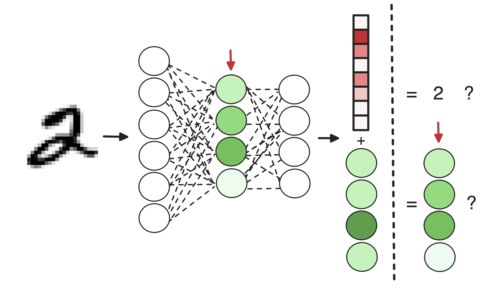
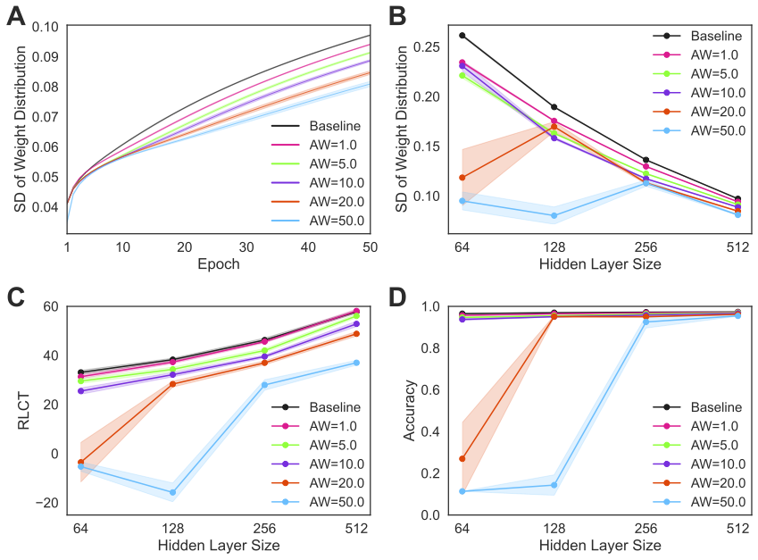
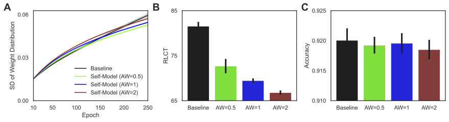
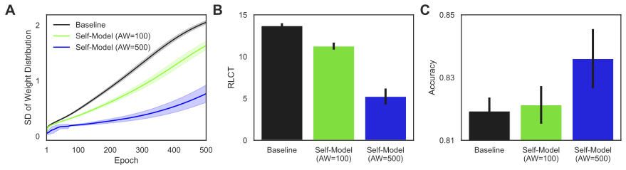

# Unexpected Benefits of Self-Modeling in Neural Systems
Code for replicating the experiments reported on in 
[Unexpected Benefits of Self-Modeling in Neural Systems](https://arxiv.org/abs/2407.10188)

## Abstract

Self-models have been a topic of great interest for decades in studies of human cognition and more recently in machine 
learning. Yet what benefits do self-models confer? Here we show that when artificial networks learn to predict their 
internal states as an auxiliary task, they change in a fundamental way. To better perform the self-model task, the 
network learns to make itself simpler, more regularized, more parameter-efficient, and therefore more amenable to being 
predictively modeled. To test the hypothesis of self-regularizing through self-modeling, we used a range of network 
architectures performing three classification tasks across two modalities. In all cases, adding self-modeling caused a 
significant reduction in network complexity. The reduction was observed in two ways. First, the distribution of weights
was narrower when self-modeling was present. Second, a measure of network complexity, the real log canonical threshold 
(RLCT), was smaller when self-modeling was present. Not only were measures of complexity reduced, but the reduction 
became more pronounced as greater training weight was placed on the auxiliary task of self-modeling. 
These results strongly support the hypothesis that self-modeling is more than simply a network learning to predict 
itself. The learning has a restructuring effect, reducing complexity and increasing parameter efficiency. This 
self-regularization may help explain some of the benefits of self-models reported in recent machine learning literature,
as well as the adaptive value of self-models to biological systems. In particular, these findings may shed light on the 
possible interaction between the ability to model oneself and the ability to be more easily modeled by others in a 
social or cooperative context.

## Figures

### MNIST

MNIST classification task results, comparing networks with and without self-modeling. Panels A-D show that self-modeling
networks exhibit variations in weight distribution width, network complexity (RLCT measure), and accuracy across 
different hidden layer sizes, highlighting that self-modeling affects network behavior and performance, with data
presented as means and 95% confidence intervals from 10 runs.

### CIFAR

The CIFAR-10 classification task results demonstrate the impact of self-modeling on network performance. Panels A-C 
illustrate that networks with varying self-modeling weights show differences in the width of weight distribution, 
network complexity (RLCT measure), and accuracy, with data averaged over 10 runs and presented with 95% confidence 
intervals.

### IMDB

The IMDB classification task results highlight the effects of self-modeling on network performance. Panels A-C show that
networks with different self-modeling weights exhibit variations in weight distribution width, network complexity 
(RLCT measure), and accuracy, with data averaged over 10 runs and presented with 95% confidence intervals. In this case, 
performance increases as the self-modeling task importance is increased.
